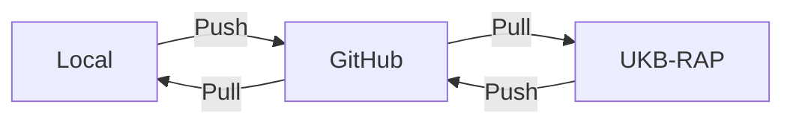
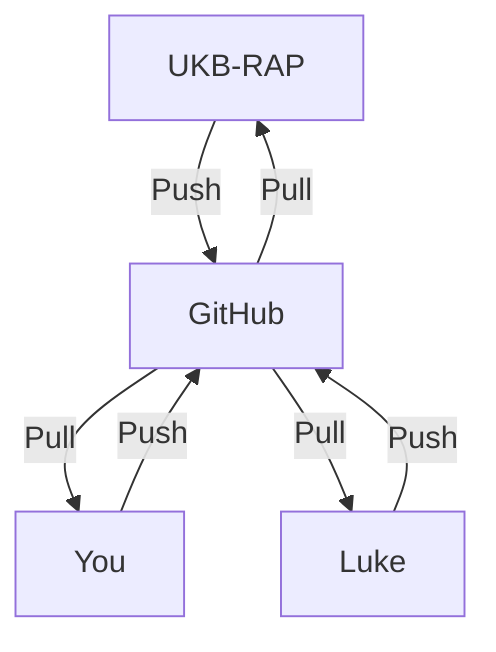

-   <a href="#ukbaid-aid-in-doing-analyses-on-the-uk-biobank-rap"
    id="toc-ukbaid-aid-in-doing-analyses-on-the-uk-biobank-rap">ukbAid: Aid
    in doing analyses on the UK Biobank RAP</a>
    -   <a href="#installation" id="toc-installation">Installation</a>
    -   <a href="#using-ukbaid" id="toc-using-ukbaid">Using ukbAid</a>
        -   <a href="#steps-when-outside-the-ukb-rap"
            id="toc-steps-when-outside-the-ukb-rap">Steps when outside the UKB
            RAP</a>
        -   <a href="#steps-when-inside-the-ukb-rap"
            id="toc-steps-when-inside-the-ukb-rap">Steps when inside the UKB RAP</a>
        -   <a href="#misc-notes" id="toc-misc-notes">Misc notes</a>
    -   <a href="#for-admin-users" id="toc-for-admin-users">For admin users</a>

<!-- README.md is generated from README.Rmd. Please edit that file -->

# ukbAid: Aid in doing analyses on the UK Biobank RAP

<!-- badges: start -->

[](https://lifecycle.r-lib.org/articles/stages.html#experimental)

<!-- badges: end -->

The goal of ukbAid is to help our research group at Steno Diabetes
Center Aarhus that is working on the UK Biobank on the RAP.

This package and the general workflow we are using will help us be as
reproducible as possible, but without sharing any data that is not
permitted. It’s a way for us to start moving in the direction of better
research practices.

## Installation

You can install the development version of ukbAid inside RStudio in the
R Console like so:

``` r
# If remotes package isn't installed, first install with (without the `#` comment):
# install.packages("remotes")
remotes::install_github("steno-aarhus/ukbAid")
```

## Using ukbAid

When working on the UKB RAP, the easiest way (that we’ve found) is to do
your work through Git and GitHub. This is due to a few reasons:

1.  *Every* time you start up and enter into the UKB RAP, the working
    computer environment is *completely* clean… No personal files, no R
    packages installed, nothing. So we need some way of saving our work
    to downloading it again when we next work in the RAP.

2.  Whenever you finish working for the day, you *must* terminate your
    RStudio session because we pay for the RStudio use every hour. So we
    can’t just leave the session running all the time, we have to turn
    it off. This forces us into the situation described in the point
    above.

3.  Since there are several of us working on this project and since we
    want to be able to collaborate and help each other out TODO: finish
    this section

### Steps when outside the UKB RAP

*Note*: Some of these tasks can be really difficult to understand what’s
going on, and that’s ok and totally normal. The very start of a project
is always some of the most difficult stage of a project. But if you
follow these tasks, you’ll have a solid foundation for doing your work
within the special environment of the UK Biobank RAP.

The very first tasks you’ll need to do is to install the ukbAid package,
as described above. After that, we need to make sure that your computer
has Git configured properly. In your Console, type out the below code,
replacing my name (Luke) and my email with your own name:

``` r
ukbAid::setup_git_config("Luke W. Johnston", "lwjohnst@gmail.com")
```

You should get an output showing your `user.email` and `user.name`.
Next, we need to create the folder and file structure. In the Console,
type out this, replacing my project abbreviated name (`ecc-cmd-ukb`)
with your project abbreviated name:

``` r
ukbAid::setup_ukb_project("~/Desktop/ecc-cmd-ukb")
```

From here, go to the Desktop or wherever you created the project and
open up the RStudio `.Rproj` file so that the project starts up in
RStudio. In this project will be the files you need to get started on
the project, and especially at this stage, the `doc/protocol.Rmd` and
the `data-raw/project-variables.csv` files. You’ll be working on these
files before beginning to use the RAP and doing analyses, but once you
are ready, you’d need to have your project on GitHub to make it easier
to import into the RAP. So, before continuing further, let’s connect
your project to GitHub right from the beginning. To do that in a
relatively easy way, we have to create a thing called a Personal Access
Token (PAT) in GitHub in order for Git on your computer to know how to
connect your project to GitHub.

If you don’t have a GitHub account, create one first. After that (or if
you already have one), when in your RStudio project, in the Console type
out this command:

``` r
usethis::create_github_token()
```

This will send you to your GitHub account and create a basic PAT for
you. Change the token’s description to something like “For UKB project”.
Set the “Expiry date” to 90 days (this is a good security feature).
Create the token, which will change pages and you’ll be shown a string
of letters starting with `ghp_`. Copy this token and save it somewhere
safe, preferably in a password manager. This token acts a bit like your
password but is safer to use than your password. Once you’ve saved it
somewhere, go back to RStudio and than run this command in the Console:

``` r
gitcreds::gitcreds_set()
```

And then paste the token into the prompt in the Console. If it asks to
replace an existing one, select the “yes” option. Doing this is a bit
like using the 2FA message with the temporary passcode you get sent
whenever you have to open your work’s email or when you use MitID or
NemID (in Denmark). Every time you open RStudio, you need to run this
command and give R the token so that it can connect to GitHub securely.

Why do we need to do this on our computer? Because whenever you connect
to GitHub through RStudio (like uploading and downloading your changes),
GitHub needs you to authenticate that it is you and not someone else. In
order to do that, you need to give GitHub a password to do that. In the
past, you could use your same password connected to your GitHub account,
but the problem with this method is that your password gets sent over
the Internet many times, which increases the risk for someone
maliciously obtaining your password. So instead, we use a temporary,
restricted-access token that we can easily create and delete. This token
only has limited access to your account, so it is safer to send over the
Internet.

After you’ve done this, run the next function. If you are new to Git and GitHub,
we strongly recommend starting your first project as private, in case you 
accidentally add files you aren't supposed. And it will also help get you
feeling comfortable with using Git and GitHub.

``` r
usethis::use_github(private = TRUE)
```

This will take your project and upload it to GitHub. Now, whenever you
use Git and save your changes to the Git history, whenever you “Push”
your changes it will be sent to your project on GitHub. The diagram
below shows how it conceptually looks like:



The “Local” is your own computer. Whenever you “push” to GitHub, it
means it will upload your file changes (like synchronizing in Dropbox).
Whenever you “pull” from GitHub, it takes any changes made on GitHub and
downloads them to your “Local” computer.

When you work on the UKB-RAP, you will “pull” (download) your project
from GitHub. As you work on it and save changes in your Git history, you
“push” (upload) to GitHub often in order to keep your changes backed up.
Then, when you get to the manusript writing stage, you can pull your
results from GitHub to your local so you can work without getting
charged.

Why do we do it this way? For one, it is honestly the easiest that we
could think of because the UKB RAP is a special environment that
requires special steps to take. Plus, it makes it easier to have others
(like me) collaborate on your project and help you out. So
hypothetically, if you need help, I (Luke) could download from your
GitHub and make changes there. Conceptually it would look like:



That way it makes it super easy for me (or others) to help out.

As you work on the project, specifically the protocol and selecting the
variables for your project from the `data-raw/project-variables.csv`
list, you’ll use Git to save the changes made and push up to GitHub.
Once your protocol has been reviewed and uploaded to OSF, you’re now
ready to start doing the data analysis on the RAP.

**But before doing anything else**, complete the tasks in the `TODO.md`
file, which will direct you to fill in details in the `README.md` and
`_targets.R` files.

After you’ve done the TODO items, start working towards writing the
protocol and analysis plan before beginning your work in the UKB RAP.

### Steps when inside the UKB RAP

Whenever you open up the UKB RAP, you won’t have your project files nor
have any packages installed. So you’ll need to do a few set up tasks
*each time* you work in the RAP. In the RStudio R Console, install the
remotes and ukbAid packages:

``` r
install.packages("remotes")
remotes::install_github("steno-aarhus/ukbAid")
```

Since UKB RAP deletes everything when you Terminate the session, you’ll
be backing up your project on GitHub. In order to connect to GitHub, you
have to let Git know that you are you (authentication). Like you did on
your computer, run in the Console and paste your secret PAT:

``` r
gitcreds::gitcreds_set()
```

Next, we’ll need to upload your project onto the RAP from GitHub. You’ll
have to give the function your GitHub user name and the repository name
for your project. Mine is
[`"lwjohnst86/ecc-cmd-ukb"`](https://github.com/lwjohnst86/ecc-cmd-ukb).
**You’ll have to replace mine with your own**. Type out:

``` r
usethis::create_from_github("lwjohnst86/ecc-cmd-ukb")
```

This will download the project from GitHub and create the project in the
RAP. The project should already open up for you, but if not, open the
project by clicking the `.Rproj` file inside the project folder.

Then, open up the README.md file in your project and follow the
instructions there. When you are ready to create the dataset necessary
for your project, open up the `data-raw/download-data.R` script and
follow the instructions there.

### Misc notes

-   **About specific variables**: There are some variables in the list
    of variables we have that don’t exist in the RAP database, for
    instance like date of birth. This may be due to privacy concerns, so
    instead you would have to use year of birth (`p34`) to determine
    their age.

-   **Save your changes in the Git history and push to your GitHub
    BEFORE Terminating your UKB-RAP project**: If you terminate before
    saving and pushing to GitHub, you *will* lose your work!

## For admin users

This is code used only by the admins.

``` r
ukbAid:::import_clean_and_upload_database_variables()
```
